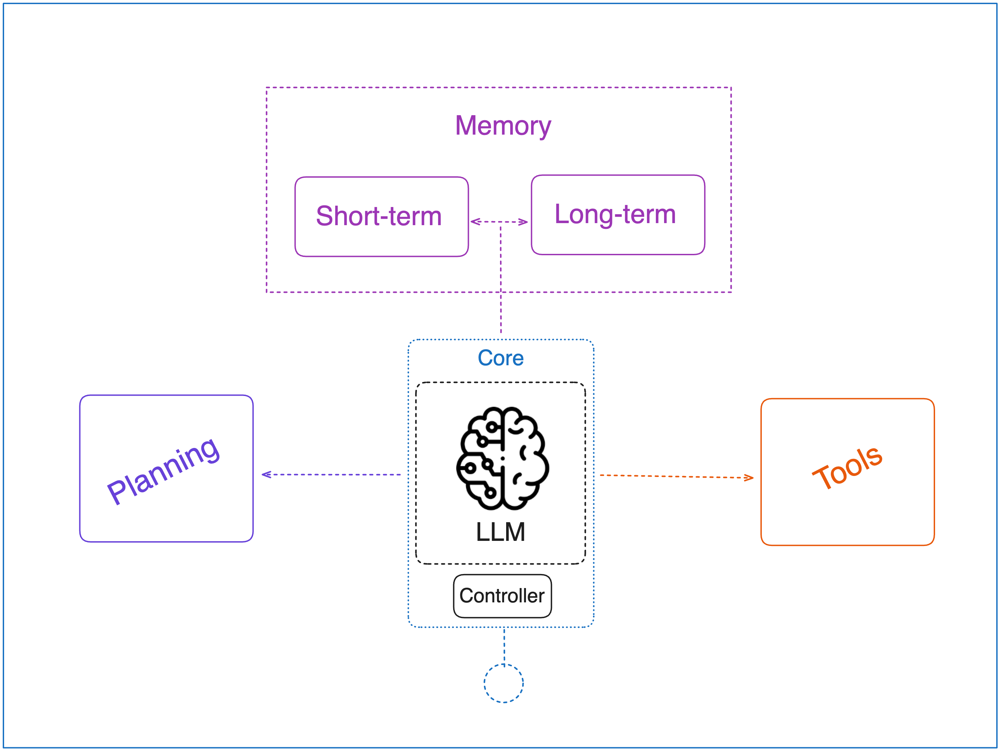

This is the repository where I will hold all of the code examples of "Building Agents from scratch" series.

The first part about implementing tool usage from scratch can be found in the [tool_use](tool_use) folder.