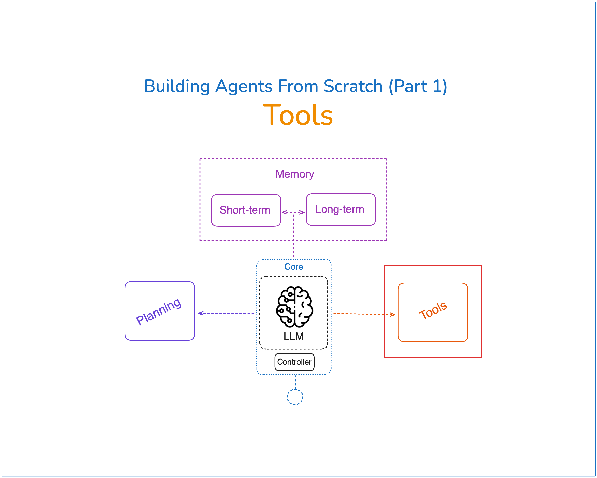

This is the first part of the "Building Agents from scratch" series where we will implement tool use for an AI Agent from scratch without using any LLM orchestration frameworks. In this example, we'll build a currency conversion tool and configure our agent to intelligently determine when currency conversion is needed and use the tool appropriately.

<p align="center">

</p>

You can find the detailed walkthrough of this project in my [Newsletter](https://www.newsletter.swirlai.com/p/building-ai-agents-from-scratch-part).


## Installing dependencies

[uv](https://github.com/astral-sh/uv) is a great tool for Python dependency management. To install the requirements:

```bash
uv pip install -r requirements.txt
```

## Running the code

First, export your OpenAI API key:

```bash
export OPENAI_API_KEY=your_api_key
```

> Note: Support for other LLM providers (like Anthropic, Mistral, etc.) is coming soon! This will allow you to run the examples with your preferred model provider.

Then you can run the example:

```bash
python3 .src/main.py
```

## Interactive Notebook

For a more interactive learning experience, you can follow along with the Jupyter notebook in the [notebooks](notebooks) folder. While detailed documentation is still being worked on, you can find the complete implementation and follow the code there.
